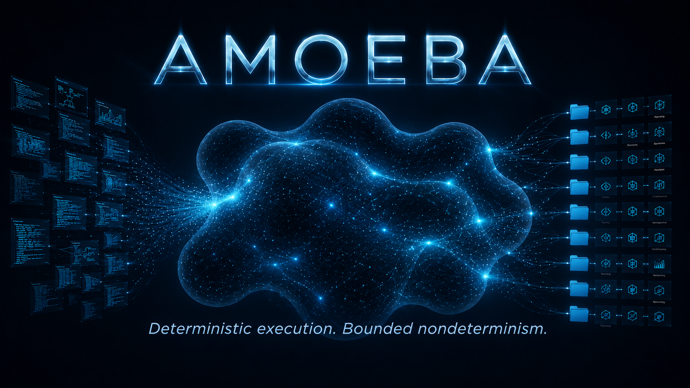

AMOEBA

Deterministic execution. Bounded nondeterminism.

I’ve started work on Amoeba, an orchestration layer designed to drive AI-assisted projects from concept through implementation while keeping the overall process deterministic, reproducible, and inspectable.

The central thesis is that nondeterministic systems—LLMs, agents, planners, reviewers, and other AI components—are most powerful when they operate within carefully bounded environments. Amoeba provides deterministic control flow around bounded nondeterministic subsystems, allowing exploration, creativity, and autonomous work without sacrificing predictability at the project level.

Initially, Amoeba will sit above Context Forge and Squadron, coordinating planning, execution, review, escalation, and lifecycle management. The goal is straightforward: automate everything that can be automated, escalate only where human judgment is genuinely the work, and maintain a clear chain of decisions from start to finish.

The repository exists. The architecture is forming. The implementation begins now.